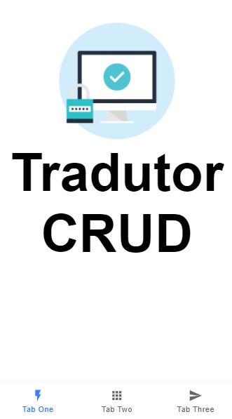
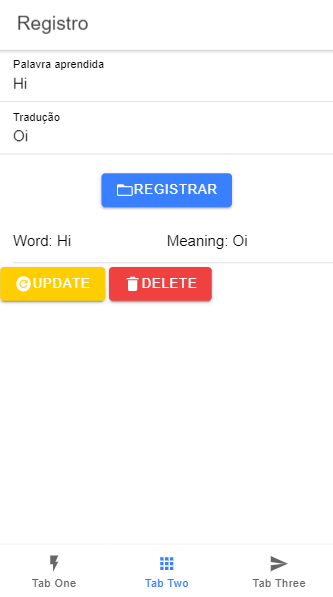
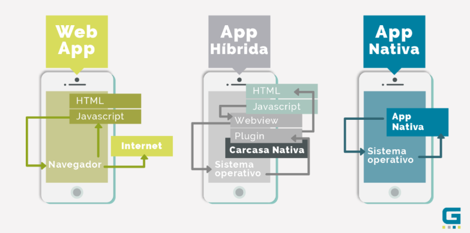
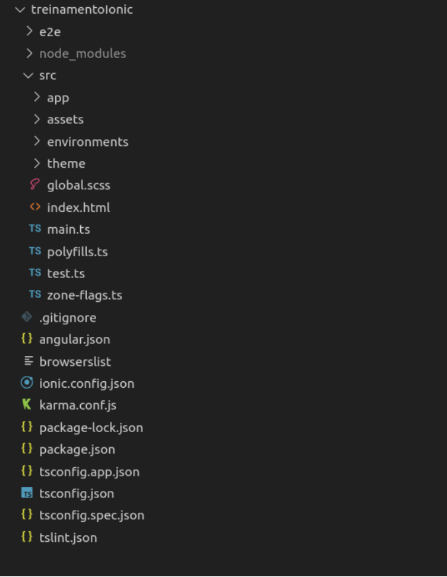

<p align="center">
  <a href="http://ant.design">
    
  </a>
</p>

<h1 align="center"> Ionic training for the <a href="https://www.linkedin.com/company/ufbatitan/"> titan devs! </a> </h1>


## Welcome to my repository


## Description 

This project illustrates an example of a simple application for storing portuguese to english words with pouchDB, a free and offline database for learning.

## Demostration

 


## What have at market ?



## What is ionic ?

Is a set of tools for developing a hybrid application.
For more information read the [ionic documentation](https://ionicframework.com/docs)

## Training Scope

The purpose of the training is to demonstrate ionic basic usage, such as:

- Understand what it is __Ionic__, __Cordova__ and __Webview__.
- Create a project
- Create a page
- Create a service
- Use modules __Node.js__.
- Understand the utilization flow with __Angular__.
- Versionalize.
- Introduce in __TypeScript__.
- Use the __ionic serve__ to run the interface web of ionic.
- Persist data using the PouchDB.

## Starting

To run the project, you will need to install the following programs:

- [Ionic: a toolkit, necessary to carry out the project](https://ionicframework.com/)
- [Nodejs: Required to create the project](https://nodejs.org/en/)
- [VS Code: For project development](https://code.visualstudio.com/)

## ⌨️ Development

Use Gitpod, a free online dev environment for GitHub.

[](https://gitpod.io/#https://github.com/Figur8/treinamentoIonicTitan.git)

```
cd "Directory of your preference"
git clone https://github.com/Suspir0n/treinamentoIonicTitan.git
```

### Construction

To build the project with Ionic, execute the commands below:

```
npm install -g ionic
```
The "-g" command will install the global __ionic__ on your system.


To start the project, run the next code:

```
ionic start trainingIonic tabs
```

The command "ionic start" will start your project, after it "trainingIonic" is the name of your project and finally the type of interface you will want from tabs, sidemenu, or blank.

Lastly:

```
cd trainingIonic
ionic serve
```
The "ionic serve" command is to run your project and show it in your default browser.

Don't forget about pouchDB:
```
npm install pouchdb
```

## Project structure



__OBS:__ This initial organization is the standard of the angular.

## WARNING

Add the following code in the file "polyfills.ts" so that it doesn't give an error when you crud your project.
```
(Window as any).global = window;
```

## Features

The project can be used as a template to start the development of a Javascript project using Nodejs. It also demonstrates in a practical way how to create a CRUD with PouchDB in ionic.

## Configuration

To execute the project, it is necessary to use  VS Code or an IDE of your preference, so that it identifies the dependencies necessary for execution in the repository. Once the project is imported, it will be possible to test its functionality in real time.

## Contributions

Contributions are always welcome! I hope that it will help someone!

## Additional Information

If you want more details about each line of code, visit this site here

- [Ismael Carvalho: Slide explaining each part of the code how it works](https://slides.com/ismaelcarvalho/deck-1)
